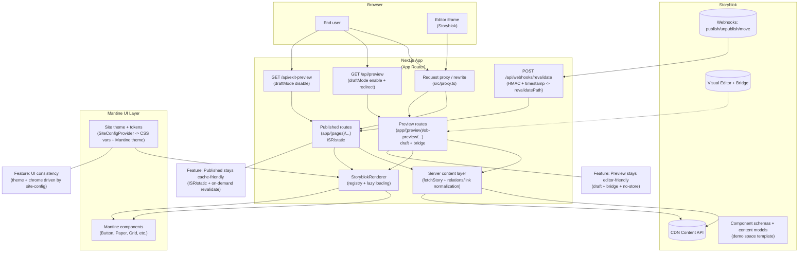

# SNMUI White Paper (2026)

**Storyblok + Next.js + Mantine UI**  
*Implementing Storyblok's Demo Space with an enterprise-lean architecture*

---

## Contents

- [Positioning Statement](#positioning-statement)
- [Abstract](#abstract)
- [Architecture Overview](#architecture-overview)
- [Executive Summary: What This Boilerplate Delivers](#executive-summary-what-this-boilerplate-delivers)
- [Accessibility & Compliance](#accessibility--compliance)
- [Competitive Differentiation](#competitive-differentiation)
- [Call to Action](#call-to-action)
- [Future Outlook](#future-outlook)
- [About the Author](#about-the-author)
- [Contact](#contact)
- [References](#references)

## Positioning Statement

SNMUI bridges the gap between learning and enterprise delivery - combining Storyblok, Next.js, and Mantine for speed, scalability, and accessibility.

---

## Abstract

Good ideas shouldn't be gated by licensing fees or heavy tools. If impactful web experiences depend on expensive platforms, many community projects and small teams never make it from prototype to public.

Storyblok changes that equation with a free tier and a Visual Editor that new and seasoned developers can use to ship real content quickly - without signing a six-figure contract. A CMS alone doesn't generate momentum. To build with confidence, teams also need a complete, flexible UI library that accelerates delivery while staying design-system-true.

Mantine UI supplies velocity and efficiency: more than 120 components, robust theming, and tree-shaking support so only what you use ships to production - helping small teams punch above their weight and move from idea to interface in hours, not weeks.

This boilerplate exists because there's a gap: a public, Storyblok + Mantine + Next.js starter that is both editor-friendly and enterprise-lean. It fills that gap with modern conventions (Next.js App Router), lazy component loading, CDN-backed image optimization (Storyblok Image Service), ISR + webhooks for predictable cache control, a registry-based component system, and CMS-driven theming - so teams can start lean and scale cleanly.

Storyblok offers something unique: a free, pre-packaged demo space that any developer can create instantly. This space comes with ready-made content, images, pages, and component schemas - a complete playground for learning the CMS and testing ideas without cost or setup friction. For new developers or small teams, this is a notable contrast with traditional enterprise CMS platforms that often require expensive licenses and complex onboarding.

**The Trade-Off**: The demo space is highly opinionated. Its content structure, component names, and design assumptions are fixed. This boilerplate respects that constraint - it implements the demo space as-is, without altering its pre-packaged content or blok definitions. As a result, it is not a generic UI kit; it's a starting point.

**Why This Matters**: The real value of this boilerplate is not the demo content - it's the enterprise-ready architecture layered on top:

- Lazy component loading for performance [6]
- Storyblok Image Service for CDN-backed optimization [10][13]
- Next.js scalability & clarity: Modern App Router conventions deliver predictable routing, server-side rendering for performance, and metadata management for SEO - helping teams build fast, maintainable apps that scale effortlessly [5]
- ISR + webhooks for predictable cache control [7][8]
- CMS-driven theming via Mantine [4]

---

## Architecture Overview

### Figure 1: SNMUI Architecture Overview

#### How to read the diagram

- **Browser**: Two entry points - the end user and the Storyblok Visual Editor iframe.
- **Next.js App (App Router)**: The core runtime - request proxy/rewrite (`src/proxy.ts`), published routes vs preview routes, plus the server content layer and renderer.
- **Storyblok**: Content comes from the CDN Content API; the Visual Editor bridge enables live preview updates; webhooks trigger revalidation.
- **Mantine UI Layer**: Rendering uses Mantine components, while theming is driven by site config (CSS vars + Mantine theme).
- **Published vs Preview behavior**: Published routes are cache-friendly (ISR/static + on-demand revalidate); preview routes are editor-friendly (draft + bridge + no-store).
- **Freshness loop**: Story publish/unpublish/move -> Storyblok webhook -> Next.js revalidate endpoint -> published cache refreshed.

---

## Executive Summary: What This Boilerplate Delivers

### An Enterprise-Lean Starter

- Storyblok accessibility: Visual editing CMS that scales from free tiers to enterprise services.
- Mantine completeness: 120+ components + Theme Provider & CSS variables for rapid MVPs and design-system consistency.
- Next.js performance & flexibility: Hybrid rendering (SSR, ISR) and App Router conventions deliver fast, scalable apps with lean bundles, predictable caching, and SEO-ready pages.

### Enterprise Essentials

- Registry-based component system, relation & link normalization, CMS-driven theme.
- Storyblok Image Service for CDN-backed transforms (format/resize/quality).
- ISR for published pages; webhooks for precise on-demand revalidation.
- Lazy component loading + Suspense for lean bundles.

### Who This Is For

- Growing teams: evolve from the demo into your own space, schemas, and component library.
- Lean/new developers, non-profits, community projects: start free, ship quickly, learn safely.

### Use Cases

- Nonprofits launching campaigns quickly without heavy infrastructure.
- Startups validating MVPs with minimal cost and maximum speed.
- Enterprises prototyping new features while maintaining scalability.

### Why This Demo Matters

- Opportunity: SNMUI lowers barriers and provides performance for lean teams.
- Escape Velocity: Mantine accelerates MVP delivery with 120+ components and robust theming without sacrificing quality or flexibility.

### Closing the Gap

From learning to launch - this stack bridges the gap between demos and production-ready architecture, accelerating onboarding and reducing time-to-market.

---

## Accessibility & Compliance

Accessibility isn't optional - it's foundational for enterprise readiness. SNMUI leverages Mantine's built-in support for semantic HTML, ARIA attributes, and keyboard navigation to help teams meet WCAG 2.1 guidelines without extra overhead.

Components like modals, menus, and form controls are designed for screen reader compatibility and focus management out of the box. Combined with Next.js's server-side rendering and predictable hydration, this stack ensures content is perceivable, operable, and robust across devices and assistive technologies.

---

## Competitive Differentiation

Unlike generic Next.js starters or CMS integrations, SNMUI combines:

- Storyblok's demo space integration for instant hands-on learning.
- Mantine's complete component library for rapid UI development.
- Enterprise-lean defaults like ISR, CDN optimization, and registry-based rendering - giving teams a scalable foundation without complexity.

---

## Call to Action

Ready to explore SNMUI?

- Start with the demo space and explore the boilerplate.
- Adapt the architecture to your domain and extend Mantine themes.
- Join the community and contribute to GitHub.
- Visit the GitHub Repository for code, documentation, and roadmap.

---

## Future Outlook

Continued development is planned for SNMUI, including indexing support with Algolia, component improvements leveraging the latest Next.js features, authentication for securing preview content, centralized fragment rendering utilities, and A/B testing integration - ensuring the stack evolves with modern best practices.

---

## About the Author

Andrew Caperton is a senior web developer with over 10 years of enterprise experience, specializing in modern web architectures using Storyblok, Next.js, and Mantine UI. He has extensive experience with Sitecore, C#/.NET, and relational databases, and has worked with many of the most popular CMS platforms while supporting multiple clients across diverse industries.

Andrew's expertise spans front-end development, backend integration, and cloud solutions, enabling him to deliver scalable, accessible, and performance-driven applications that align technical implementation with strategic business goals.

---

## Contact

-  [andrew@andrewcaperton.me](mailto:andrew@andrewcaperton.me)
-  [linkedin.com/in/andrew-caperton-63242782](https://www.linkedin.com/in/andrew-caperton-63242782/)
-  [andrewcaperton.me](https://andrewcaperton.me)

---

## References

1. Storyblok pricing/factsheet: <https://a.storyblok.com/f/88751/x/7bb3fb4be5/2025-pricing-plans.pdf>
2. Storyblok pricing overview: <https://www.getapp.com/websiteecommerce/software/a/storyblok/pricing/>
3. Mantine overview: <https://mantine.dev/>
4. Mantine theming & Theme Provider: <https://mantine.dev/theming/mantine-provider/>
5. Next.js App Router: [https://nextjs.org/docs/app](https://nextjs.org/docs/app)
6. React.lazy & Suspense: [https://react.dev/reference/react/lazy](https://react.dev/reference/react/lazy)
7. ISR (App Router): [https://nextjs.org/docs/app/guides/incremental-static-regeneration](https://nextjs.org/docs/app/guides/incremental-static-regeneration)
8. On-demand revalidation: [https://nextjs.org/docs/pages/guides/incremental-static-regeneration](https://nextjs.org/docs/pages/guides/incremental-static-regeneration)
9. Storyblok spaces: <https://www.storyblok.com/docs/manuals/spaces>
10. Storyblok Image Service: <https://www.storyblok.com/docs/api/image-service>
11. Next.js + Storyblok image optimization: <https://focusreactive.com/nextjs-and-storyblok-imageoptimizationpart2/>
12. Storyblok relations: <https://www.storyblok.com/docs/api/contentdelivery/v2/stories/examples/retrieving-stories-with-resolved-relations>
13. Image optimization lessons: <https://www.headlesscreator.com/improving-webperformance-using-thestoryblok-image-transformation-api>
14. Link resolution caveats: <https://github.com/storyblok/storyblok/issues/694>
15. Storyblok CDN behavior: <https://www.storyblok.com/docs/api/content-delivery/v2/gettingstarted/cdn>
16. Visual Editor concept: <https://www.storyblok.com/docs/manuals/visual-editor>
17. Access tokens: <https://www.storyblok.com/docs/concepts/access-tokens>
18. Example HTTPS preview setup: <https://github.com/storyblok/blueprint-core-svelte>

[8]: https://nextjs.org/docs/pages/guides/incremental-static-regeneration
[13]: https://www.headlesscreator.com/improving-webperformance-using-thestoryblok-image-transformation-api
