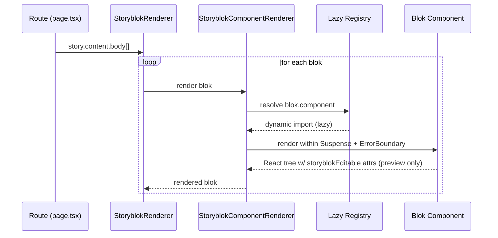

# Storyblok Component Resolution & Rendering Chain

Purpose: show how a fetched Storyblok story becomes rendered React components with lazy registry, Suspense, and edit attributes.

Notes
- Server fetches story JSON; StoryblokRenderer walks `content.body`.
- StoryblokComponentRenderer resolves blok type from lazy registry, dynamically imports the component, wraps with Suspense + ErrorBoundary.
- storyblokEditable attributes are applied in preview/visual editor to enable click-to-edit.
- Mantine theme + SiteConfig vars already applied by providers/layout.

