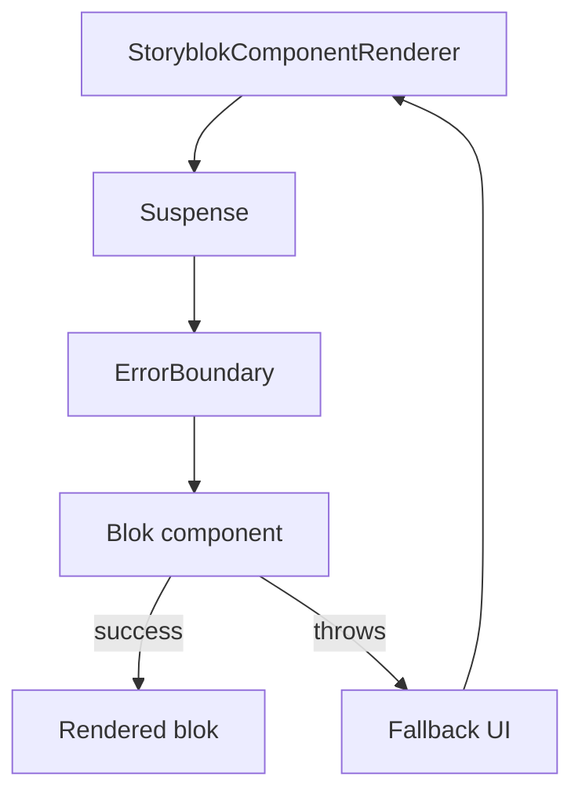

# Error Boundaries & Fallbacks

Purpose: show how rendering is protected when a blok or registry import fails, especially in preview.

Notes
- StoryblokComponentRenderer wraps each blok in Suspense + ErrorBoundary.
- Errors are contained to the blok; the page continues rendering.
- Preview still keeps editable attrs where possible.

