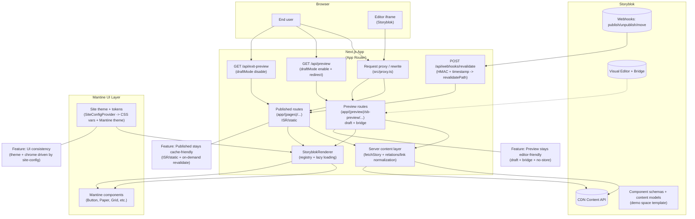

# SNMUI Architecture

High-level view of the Storyblok + Next.js (App Router) + Mantine UI framework.

```mermaid
flowchart TB
%% SNMUI = Storyblok + Next.js + Mantine UI

subgraph SB[Storyblok]
SB_CDN[(CDN Content API)]
SB_VE[(Visual Editor + Bridge)]
SB_WH[(Webhooks: publish/unpublish/move)]
SB_MODELS["Component schemas + content models<br/>(demo space template)"]
end

subgraph NX["Next.js App<br/>(App Router)"]
NX_PROXY["Request proxy / rewrite<br/>(src/proxy.ts)"]

NX_PUB["Published routes<br/>(app/(pages)/...)<br/>ISR/static"]
NX_PREV["Preview routes<br/>(app/(preview)/sb-preview/...)<br/>draft + bridge"]

NX_API_PREVIEW["GET /api/preview<br/>(draftMode enable + redirect)"]
NX_API_EXIT["GET /api/exit-preview<br/>(draftMode disable)"]

NX_API_REVALIDATE["POST /api/webhooks/revalidate<br/>(HMAC + timestamp -> revalidatePath)"]

NX_FETCH["Server content layer<br/>(fetchStory + relations/link normalization)"]
NX_RENDER["StoryblokRenderer<br/>(registry + lazy loading)"]
end

subgraph UI[Mantine UI Layer]
M_THEME["Site theme + tokens<br/>(SiteConfigProvider -> CSS vars + Mantine theme)"]
M_COMP["Mantine components<br/>(Button, Paper, Grid, etc.)"]
end

subgraph CLIENT[Browser]
USER[End user]
EDITOR["Editor iframe<br/>(Storyblok)"]
end

%% Primary flows
USER --> NX_PROXY
EDITOR --> NX_PROXY

%% Editor detection -> preview route
NX_PROXY --> NX_PUB
NX_PROXY --> NX_PREV

%% Preview control
USER --> NX_API_PREVIEW --> NX_PREV
USER --> NX_API_EXIT --> NX_PUB

%% Data fetches
NX_PUB --> NX_FETCH --> SB_CDN
NX_PREV --> NX_FETCH --> SB_CDN

%% Rendering
NX_PUB --> NX_RENDER --> M_COMP
NX_PREV --> NX_RENDER --> M_COMP
M_THEME --> NX_RENDER

%% Live updates in Visual Editor
SB_VE -.-> NX_PREV

%% Freshness
SB_WH --> NX_API_REVALIDATE --> NX_PUB

%% Feature annotations (as lightweight nodes)
F1["Feature: Published stays cache-friendly<br/>(ISR/static + on-demand revalidate)"]
F2["Feature: Preview stays editor-friendly<br/>(draft + bridge + no-store)"]
F3["Feature: UI consistency<br/>(theme + chrome driven by site-config)"]

NX_PUB --- F1
NX_PREV --- F2
M_THEME --- F3
```
