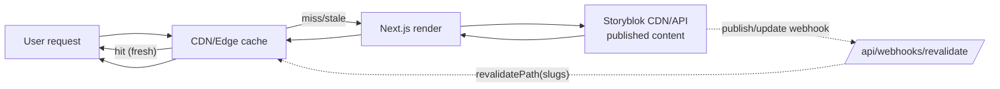

# ISR Cache Lifecycle (Published Routes)

Purpose: depict how ISR populates/serves content, and how webhooks invalidate stale pages.

Notes
- ISR window ~10 minutes; first miss triggers render and cache fill.
- Webhooks call revalidatePath to invalidate affected slugs.

