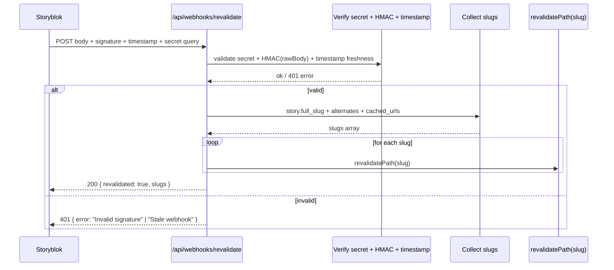

# Webhook Revalidation Sequence

Purpose: illustrate Storyblok publish/update webhook handling, signature/timestamp checks, slug collection, and Next.js revalidation calls.

Notes
- Webhook hits `/api/webhooks/revalidate?secret=...` with headers `x-storyblok-signature` (HMAC SHA1) and `x-storyblok-request-timestamp`.
- We accept if: secret matches, signature matches raw body, timestamp is fresh (± tolerated skew), then revalidate collected slugs.
- Slugs come from `story.full_slug`, `story.alternates[].full_slug`, and `cached_urls`.
- Fail fast on invalid secret/signature/stale timestamp; no revalidation on failure.

