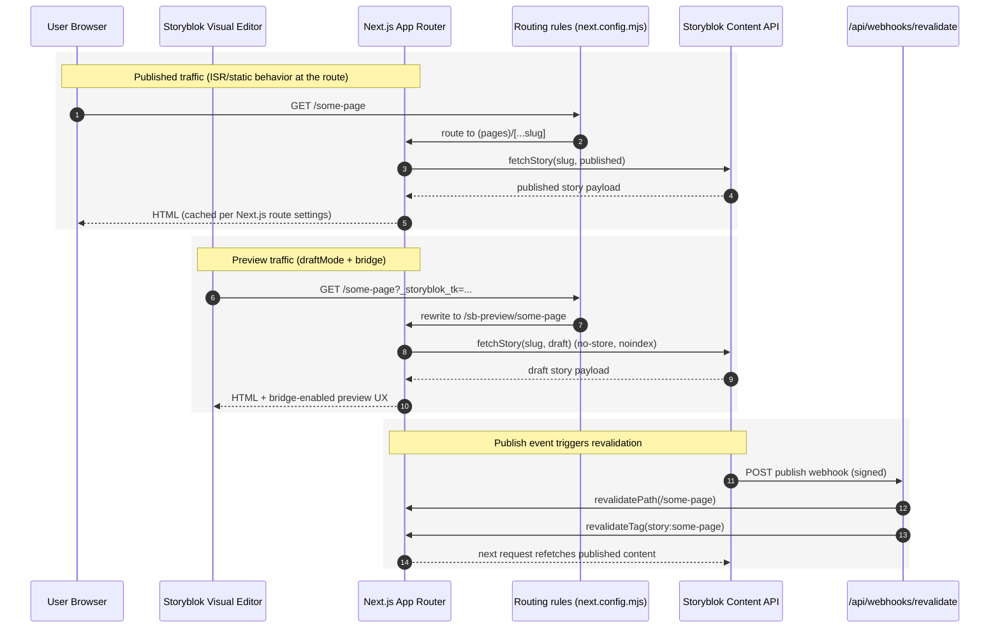

# Content Freshness: ISR + Preview + Webhooks

Focus: how published pages stay cache-friendly while editors get fresh draft content.

```mermaid
sequenceDiagram
  autonumber
  participant User as User Browser
  participant Editor as Storyblok Visual Editor
  participant Next as Next.js App Router
  participant Proxy as Routing rules (next.config.mjs)
  participant SB as Storyblok Content API
  participant Hook as /api/webhooks/revalidate

  rect rgb(245,245,245)
    note over User,Next: Published traffic (ISR/static behavior at the route)
    User->>Proxy: GET /some-page
    Proxy->>Next: route to (pages)/[...slug]
    Next->>SB: fetchStory(slug, published)
    SB-->>Next: published story payload
    Next-->>User: HTML (cached per Next.js route settings)
  end

  rect rgb(245,245,245)
    note over Editor,Next: Preview traffic (draftMode + bridge)
    Editor->>Proxy: GET /some-page?_storyblok_tk=...
    Proxy->>Next: rewrite to /sb-preview/some-page
    Next->>SB: fetchStory(slug, draft) (no-store, noindex)
    SB-->>Next: draft story payload
    Next-->>Editor: HTML + bridge-enabled preview UX
  end

  rect rgb(245,245,245)
    note over SB,Next: Publish event triggers revalidation
    SB->>Hook: POST publish webhook (signed)
    Hook->>Next: revalidatePath(/some-page)
    Hook->>Next: revalidateTag(story:some-page)
    Next-->>SB: next request refetches published content
  end
```
