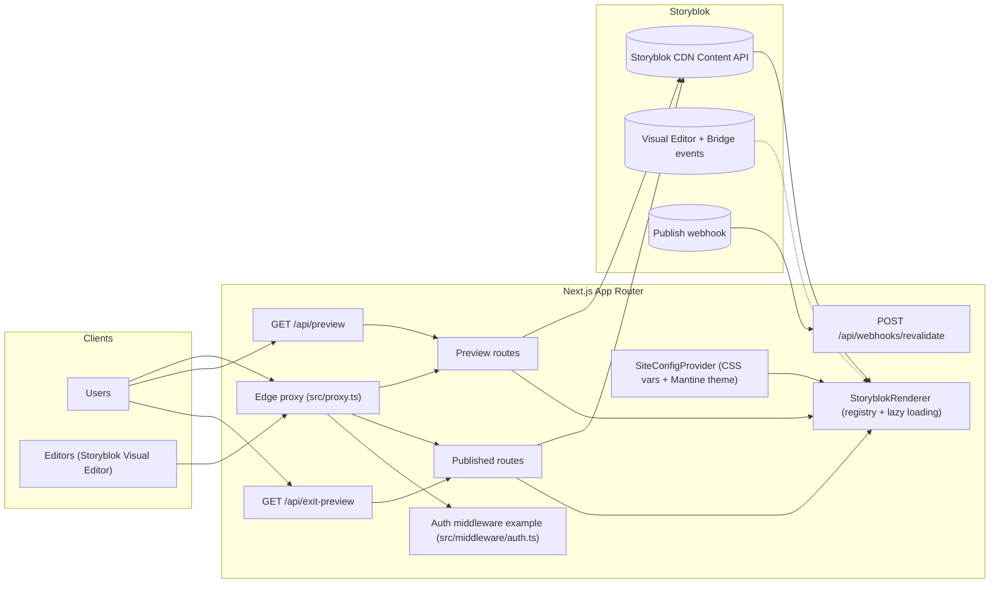

# Project Architecture (Tech Stack)

Focus: Next.js App Router + Storyblok + Mantine. This diagram intentionally omits hosting/domains.

Notes

- Published route: `app/(pages)/...` (ISR/static)
- Preview route: `app/(preview)/sb-preview/...` (draft + bridge)
- Editor requests are rewritten to preview via `next.config.mjs` rewrites
- Publish events should call `/api/webhooks/revalidate`

