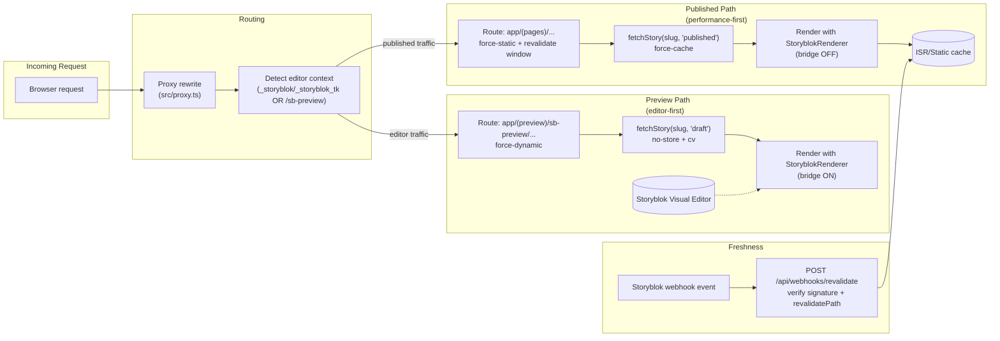

# Published vs Preview

```mermaid
flowchart LR
%% Focus: show the split between published (ISR/static) and preview (draft + bridge)

subgraph IN[Incoming Request]
RQ[Browser request]
end

subgraph ROUTING[Routing]
PROXY["Proxy rewrite<br/>(src/proxy.ts)"]
DETECT["Detect editor context<br/>(_storyblok/_storyblok_tk OR /sb-preview)"]
end

subgraph PUB["Published Path<br/>(performance-first)"]
PUB_ROUTE["Route: app/(pages)/...<br/>force-static + revalidate window"]
PUB_FETCH["fetchStory(slug, 'published')<br/>force-cache"]
PUB_RENDER["Render with StoryblokRenderer<br/>(bridge OFF)"]
ISR[(ISR/Static cache)]
end

subgraph PREV["Preview Path<br/>(editor-first)"]
PREV_ROUTE["Route: app/(preview)/sb-preview/...<br/>force-dynamic"]
PREV_FETCH["fetchStory(slug, 'draft')<br/>no-store + cv"]
PREV_RENDER["Render with StoryblokRenderer<br/>(bridge ON)"]
VE[(Storyblok Visual Editor)]
end

subgraph HOOKS[Freshness]
WH["Storyblok webhook event"]
REVALIDATE["POST /api/webhooks/revalidate<br/>verify signature + revalidatePath"]
end

RQ --> PROXY --> DETECT

DETECT -->|published traffic| PUB_ROUTE
DETECT -->|editor traffic| PREV_ROUTE

%% Published
PUB_ROUTE --> PUB_FETCH --> PUB_RENDER --> ISR

%% Preview
PREV_ROUTE --> PREV_FETCH --> PREV_RENDER
VE -.-> PREV_RENDER

%% Webhook
WH --> REVALIDATE --> ISR

```
