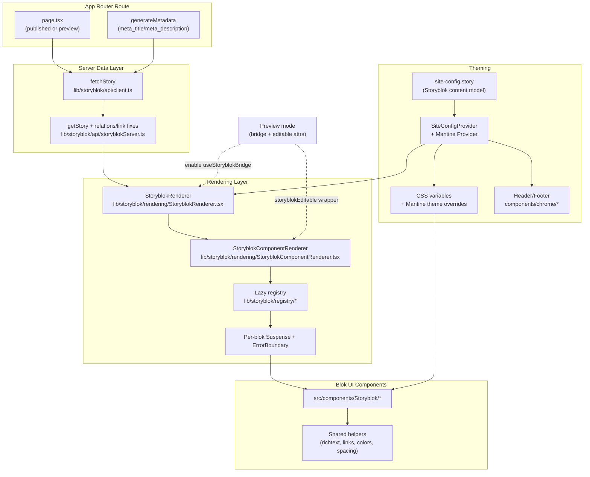

# Rendering & Theming Architecture

Focus: how Storyblok bloks become React UI (Mantine), and how site-config drives theme/chrome.

```mermaid
flowchart TB
  subgraph Route[App Router Route]
    Page["page.tsx<br/>(published or preview)"]
    Meta["generateMetadata<br/>(meta_title/meta_description)"]
  end

  subgraph Data[Server Data Layer]
    Fetch["fetchStory<br/>lib/storyblok/api/client.ts"]
    Server["getStory + relations/link fixes<br/>lib/storyblok/api/storyblokServer.ts"]
  end

  subgraph Render[Rendering Layer]
    SBRenderer["StoryblokRenderer<br/>lib/storyblok/rendering/StoryblokRenderer.tsx"]
    CompRenderer["StoryblokComponentRenderer<br/>lib/storyblok/rendering/StoryblokComponentRenderer.tsx"]
    Registry["Lazy registry<br/>lib/storyblok/registry/*"]
    Boundary[Per-blok Suspense + ErrorBoundary]
  end

  subgraph Theme[Theming]
    SiteConfig["site-config story<br/>(Storyblok content model)"]
    Provider["SiteConfigProvider<br/>+ Mantine Provider"]
    CssVars["CSS variables<br/>+ Mantine theme overrides"]
    Chrome["Header/Footer<br/>components/chrome/*"]
  end

  subgraph UI[Blok UI Components]
    Bloks[src/components/Storyblok/*]
    Utils["Shared helpers<br/>(richtext, links, colors, spacing)"]
  end

  Page --> Fetch --> Server
  Server --> SBRenderer
  Meta --> Fetch

  SBRenderer --> CompRenderer
  CompRenderer --> Registry
  Registry --> Boundary --> Bloks
  Bloks --> Utils

  SiteConfig --> Provider --> CssVars
  Provider --> Chrome
  Provider --> SBRenderer
  CssVars --> Bloks

  %% Preview-only behavior
  Preview["Preview mode<br/>(bridge + editable attrs)"]
  Preview -. enable useStoryblokBridge .-> SBRenderer
  Preview -. storyblokEditable wrapper .-> CompRenderer
```
