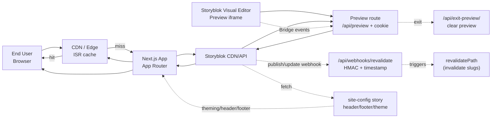

# System Context — Storyblok + Next.js + Mantine

Purpose: show how content flows between Storyblok, the Next.js App Router runtime, CDN/edge caching, preview, and webhooks.

Notes

- Published: user → CDN (hit/miss) → Next.js → Storyblok CDN/API → CDN fill → user.
- Preview: Visual Editor iframe → preview route (cookie) → Storyblok CDN/API; Bridge events live-update the iframe.
- Webhooks: publish/update → /api/webhooks/revalidate (HMAC + timestamp) → revalidatePath; /api/exit-preview clears preview mode.
- Site-config story supplies header/footer/theme tokens and Mantine theme overrides.
- ISR window ~10 minutes on published routes; local dev uses self-signed HTTPS certs.

