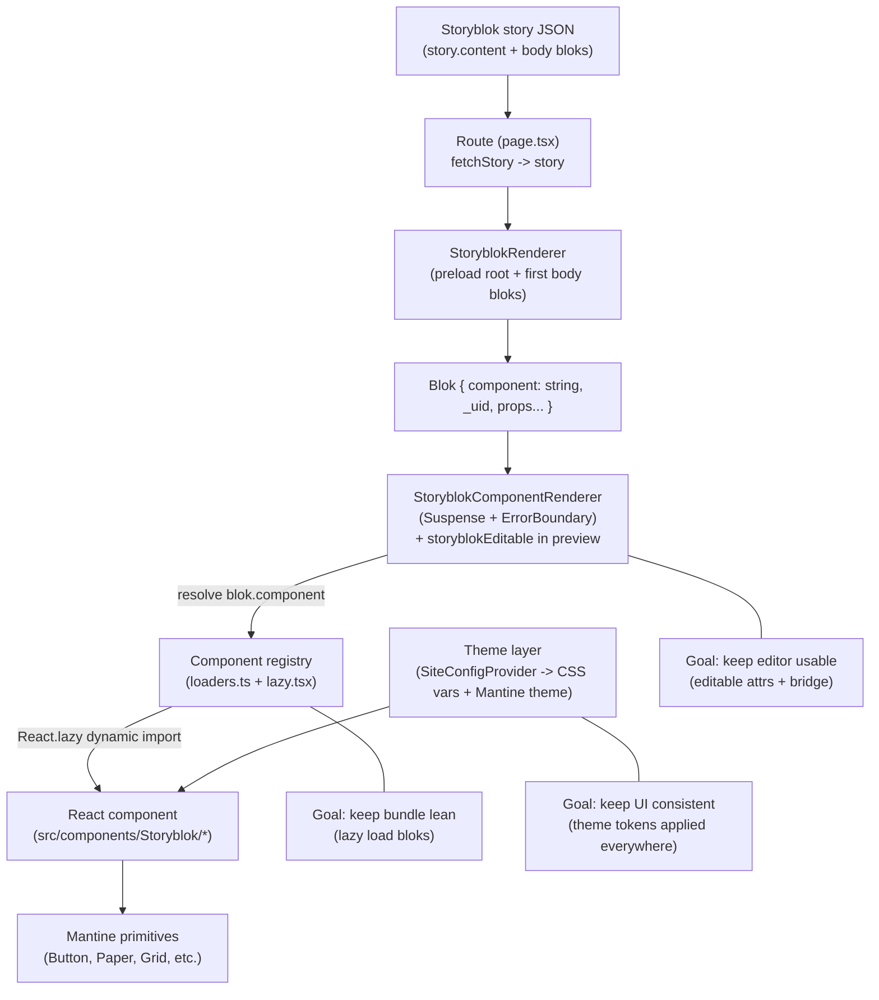

# Component Registry

Purpose: show how Storyblok bloks are resolved to React components via the lazy registry, then rendered using Mantine and theme tokens.

```mermaid
flowchart TB
%% Component registry: Storyblok blok -> registry -> React component -> Mantine UI

SBJSON["Storyblok story JSON<br/>(story.content + body bloks)"]

ROUTE["Route (page.tsx)<br/>fetchStory -> story"]
RENDERER["StoryblokRenderer<br/>(preload root + first body bloks)"]
COMP_RENDERER["StoryblokComponentRenderer<br/>(Suspense + ErrorBoundary)<br/>+ storyblokEditable in preview"]

REGISTRY["Component registry<br/>(loaders.ts + lazy.tsx)"]

BLOK["Blok { component: string, _uid, props... }"]

REACT_COMP["React component<br/>(src/components/Storyblok/*)"]
MANTINE["Mantine primitives<br/>(Button, Paper, Grid, etc.)"]
THEME["Theme layer<br/>(SiteConfigProvider -> CSS vars + Mantine theme)"]

%% Flow
SBJSON --> ROUTE --> RENDERER
RENDERER --> BLOK --> COMP_RENDERER

COMP_RENDERER -->|resolve blok.component| REGISTRY
REGISTRY -->|React.lazy dynamic import| REACT_COMP

THEME --> REACT_COMP
REACT_COMP --> MANTINE

%% Notes as nodes
NOTE1["Goal: keep bundle lean<br/>(lazy load bloks)"]
NOTE2["Goal: keep editor usable<br/>(editable attrs + bridge)"]
NOTE3["Goal: keep UI consistent<br/>(theme tokens applied everywhere)"]

REGISTRY --- NOTE1
COMP_RENDERER --- NOTE2
THEME --- NOTE3
```
