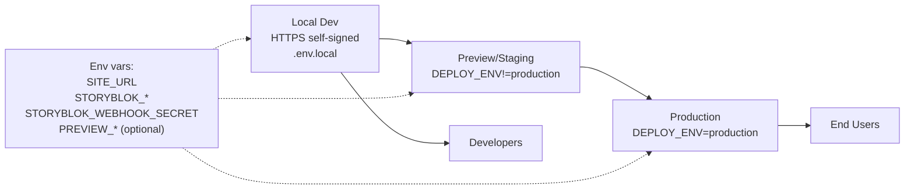

# Deployment & Environments

Purpose: outline environments, secrets, and HTTPS dev setup for running the app.

## Key points

- This repo distinguishes **production** vs **non-production** deploys for both preview access and SEO indexing.
- Non-production deploys are globally `noindex` (see [seo-indexing-and-sitemaps.md](seo-indexing-and-sitemaps.md)).
- Preview access is **allowed by default** in non-production environments; production can be gated.

## Environment detection

We treat a deploy as non-production when:

- `NODE_ENV !== 'production'`, OR
- `DEPLOY_ENV` / `NEXT_PUBLIC_DEPLOY_ENV` is set and not `production`, OR
- `VERCEL_ENV` is set and not `production`.

`DEPLOY_ENV` exists mainly for self-hosted staging where `NODE_ENV=production` but we still want “staging-like” behavior.

## Configuration (env vars)

See [.env.example](../../.env.example) for the canonical list.

Commonly used:

- `SITE_URL`: canonical base URL used for metadata + robots + sitemap.
- `STORYBLOK_PREVIEW_TOKEN`: server token for draft fetches (Visual Editor / preview).
- `STORYBLOK_PUBLIC_TOKEN`: server token for published fetches (recommended).
- `STORYBLOK_WEBHOOK_SECRET`: verifies publish webhooks to trigger revalidation.

Preview gating (optional, recommended for production):

- `PREVIEW_ALLOWED_HOSTS`: host allowlist for production preview.
- `PREVIEW_GATE_PASSWORD`: human-entered password for `/sb-preview/login`.
- `PREVIEW_AUTH_SECRET`: HMAC signing key for the preview auth cookie.

