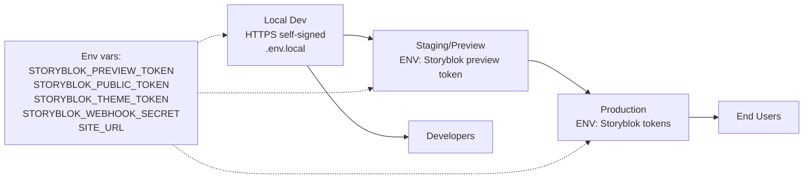

# Deployment & Environments

Purpose: outline environments, secrets, and HTTPS dev setup for running the app.

Notes

- Environments: local dev (self-signed HTTPS), staging/preview, production.
- Secrets: Storyblok tokens, webhook secret, canonical site URL.
- Preview enables draft fetch; production uses published + ISR.

