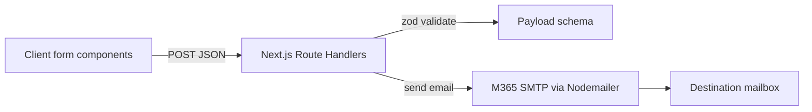

# Form Email (Microsoft 365 SMTP)

Purpose: document how newsletter + contact forms submit to server-side endpoints and send notification emails via Microsoft 365 SMTP.

## High-level flow

## Endpoints

### Newsletter

- Route: `POST /api/forms/newsletter`
- Handler: [src/app/api/forms/newsletter/route.ts](../../src/app/api/forms/newsletter/route.ts)
- Payload:
  - `email` (required)
- Response:
  - `200 { ok: true }` on success
  - `400 { error, details }` for validation issues
  - `500 { error, message }` for mail transport failures

### Contact

- Route: `POST /api/forms/contact`
- Handler: [src/app/api/forms/contact/route.ts](../../src/app/api/forms/contact/route.ts)
- Payload:
  - `name` (required)
  - `email` (required)
  - `intent` (optional; also accepts empty string)
  - `subject` (optional; also accepts empty string)
  - `message` (optional; also accepts empty string)

`intent` is constrained to:

- Hire you for a project
- Discuss a full-time role
- Get consultation or advice
- Explore collaboration
- Connect for networking
- Other

Email behavior:

- The notification email is sent to `M365_TO_EMAIL` (defaults to `M365_EMAIL`).
- `replyTo` is set to the submitter’s email.

## Client wiring

The form components are client components that call the endpoints above with `fetch()` and show loading/success/error UI:

- Newsletter: [src/components/Storyblok/Forms/NewsletterFormSection/NewsletterFormSection.tsx](../../src/components/Storyblok/Forms/NewsletterFormSection/NewsletterFormSection.tsx)
- Contact: [src/components/Storyblok/Forms/ContactFormSection/ContactFormSection.tsx](../../src/components/Storyblok/Forms/ContactFormSection/ContactFormSection.tsx)
- Generic blok-driven form section: [src/components/Storyblok/Forms/FormSection/FormSection.tsx](../../src/components/Storyblok/Forms/FormSection/FormSection.tsx)

## Server mailer

Mailer utility:

- [src/lib/email/m365Mailer.ts](../../src/lib/email/m365Mailer.ts)

Key points:

- Uses `smtp.office365.com:587` with STARTTLS (`secure: false`, `requireTLS: true`).
- Reads config from environment variables.
- Throws early if required vars are missing.

## Configuration

See [.env.example](../../.env.example) for the canonical list.

Required:

- `M365_EMAIL`
- `M365_PASSWORD`

Optional overrides:

- `M365_SMTP_HOST` (default `smtp.office365.com`)
- `M365_SMTP_PORT` (default `587`)
- `M365_FROM_EMAIL` (default `M365_EMAIL`)
- `M365_TO_EMAIL` (default `M365_EMAIL`)

Operational notes (Microsoft 365):

- Some tenants require SMTP AUTH to be enabled for the mailbox and/or an app password (if MFA is enabled).
- If you see authentication failures (`535`, `EAUTH`), check tenant policies and mailbox SMTP AUTH settings.

## Local testing

With local dev running, you can test the endpoints:

- Newsletter:
  - `curl -X POST https://localhost:3010/api/forms/newsletter -H "Content-Type: application/json" -d "{\"email\":\"test@example.com\"}"`
- Contact:
  - `curl -X POST https://localhost:3010/api/forms/contact -H "Content-Type: application/json" -d "{\"name\":\"Test\",\"email\":\"test@example.com\",\"intent\":\"Other\",\"message\":\"Hello\"}"`

## Security

- Never commit real secrets. Use `.env.local` locally and keep it untracked.
- Store the production values in Vercel Project Settings → Environment Variables.
- Rotate credentials if they’re ever pasted into chat logs, issues, or screenshots.
