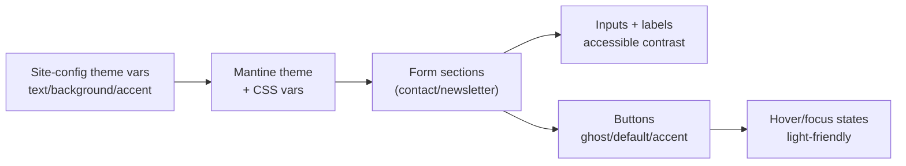

# Form UX & Styling

Purpose: show how form sections (contact/newsletter) inherit theme tokens and apply contrast-safe styles.

Notes

- Forms are client components styled via Mantine theme + CSS vars from site-config.
- Newsletter CTA uses accent button styling; inputs maintain accessible contrast in light theme.

