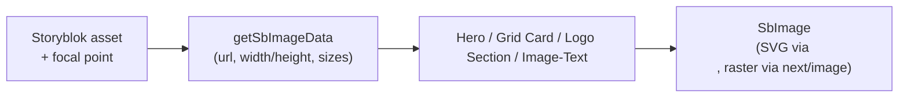

# Image Handling & Focal Points

Purpose: illustrate how Storyblok assets are turned into responsive images with focus awareness.

Notes

- `getSbImageData` reads asset metadata, focus, and size prefs; returns URL + sizing metadata.
- Components (logo grids, cards, hero, image-text) consume this helper to respect focal points and aspect constraints.

## SbImage wrapper (SVG-safe)

We use a small wrapper component to avoid sending SVG assets through the Next image pipeline:

- Component: [src/components/ui/SbImage/SbImage.tsx](../../src/components/ui/SbImage/SbImage.tsx)
- Behavior:
  - If `src` is an SVG, render a plain ``.
  - Otherwise render `next/image`.

Most UI components should prefer `SbImage` over importing `next/image` directly.

## ImageCard aspect ratio expectations

The `ImageCard` component is tuned around a **known media aspect ratio** of **451:360**.

Why this is a good idea:

- It keeps cards visually consistent across grids and breakpoints (stable layout, predictable heights).
- It prevents “unintentional crops” when ImageCards are used in responsive 1–2 column layouts.

What this means for content:

- For the best results, supply images that are the same or similar aspect ratio (≈ 451:360).
- If you use images with a very different aspect ratio (very tall portraits or very wide landscapes), you may see extra letterboxing or composition you don’t want.

If you need to support a different aspect ratio, update:

- The media box ratio in [src/components/Storyblok/ImageCard/ImageCard.module.scss](src/components/Storyblok/ImageCard/ImageCard.module.scss) (`.imageInner { aspect-ratio: ... }`).
- The rendering behavior in the same file (`.img { object-fit: ...; object-position: ... }`) depending on whether you want “no crop” (`contain`) or “edge-to-edge fill” (`cover`).

