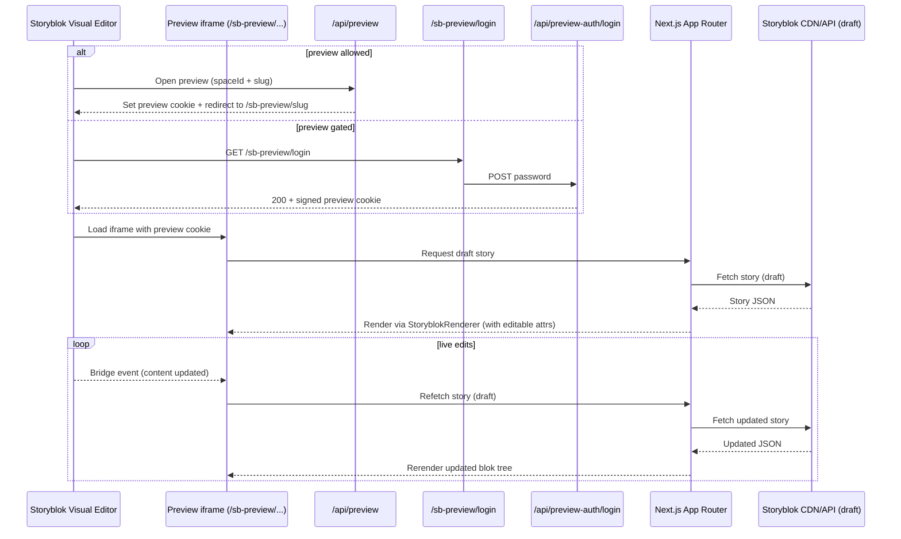

# Preview & Visual Editor Live Update

Purpose: show how the Storyblok Visual Editor iframe interacts with the app, sets preview mode, and receives live updates via the Storyblok Bridge.

Notes

- `/api/preview` enables Next.js draft mode; `/sb-preview/...` routes render draft stories.
- Production preview can be gated behind a login page (`/sb-preview/login`) that issues a signed preview-auth cookie.
- Storyblok Bridge listens for content changes and triggers rerenders inside the iframe.
- `storyblokEditable` attributes enable click-to-edit in the Visual Editor.
- Navigation behavior: the Visual Editor iframe disables link navigation to avoid leaving the editor context; when browsing `/sb-preview/...` in a normal tab, internal links stay within `/sb-preview/...`.

## Preview login / logout (optional)

Endpoints:

- `GET /sb-preview/login` renders a password form.
- `POST /api/preview-auth/login` validates `PREVIEW_GATE_PASSWORD`, enables draft mode, and sets a signed cookie (name: `PREVIEW_AUTH_COOKIE_NAME`, default `preview_auth`).
- `GET /sb-preview/logout` clears draft mode and clears the preview-auth cookie.

This is intended as a lightweight gate for production preview without introducing a full auth system.

