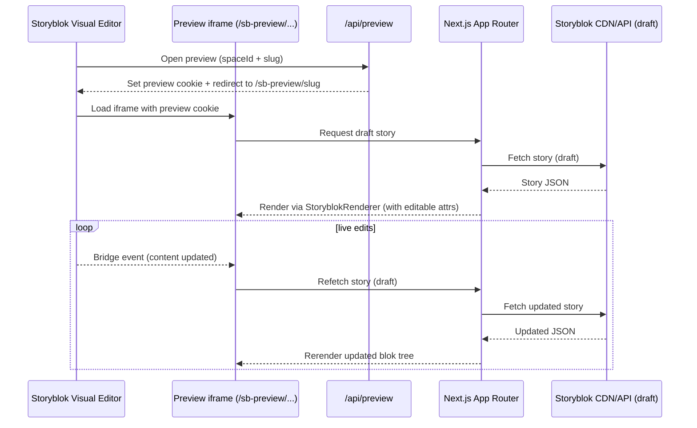

# Preview & Visual Editor Live Update

Purpose: show how the Storyblok Visual Editor iframe interacts with the app, sets preview mode, and receives live updates via the Storyblok Bridge.

Notes

- `/api/preview` sets the preview cookie; `/sb-preview/...` routes render draft stories.
- Storyblok Bridge listens for content changes and triggers rerenders inside the iframe.
- `storyblokEditable` attributes enable click-to-edit in the Visual Editor.

