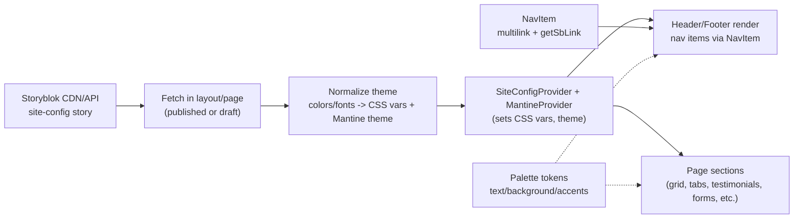

# Site Config & Theming Flow

Purpose: show how the Storyblok `site-config` story drives header/footer, CSS variables, and Mantine theme for all sections.

Notes

- Layout fetches `site-config` (published or draft depending on mode).
- Colors/fonts are normalized into CSS variables and Mantine theme overrides.
- Header/footer/nav come from site-config bloks (NavItem uses getSbLink sanitizer).
- Page sections inherit theme tokens (light surfaces, text color, button styles) via providers.

## Sources of truth

There are three layers that work together:

1. **Global CSS tokens (defaults + dark-mode defaults)**
  - Defined in [src/styles/globals.scss](../../src/styles/globals.scss)
  - Dark mode uses the selector `:root[data-mantine-color-scheme='dark']`.

2. **Runtime overrides from Storyblok `site-config`**
  - Applied by `SiteConfigProvider` (colors/fonts/radius are normalized and applied as CSS vars + Mantine theme overrides).
  - Implementation: [src/lib/storyblok/context/SiteConfigContext.tsx](../../src/lib/storyblok/context/SiteConfigContext.tsx)

3. **Mantine theme palettes + semantic defaults**
  - Palettes (Neon Ice, Bubblegum, etc.) and semantic tokens live in [src/lib/mantine/theme.ts](../../src/lib/mantine/theme.ts)

## Light vs dark mode (how it’s chosen)

- Mantine sets `data-mantine-color-scheme` on `<html>`.
- The initial value is written by Mantine’s `ColorSchemeScript` in the published/preview layouts.
- User preference is persisted in localStorage key `site-color-scheme`.

Entry points:

- Published layout: [src/app/(pages)/layout.tsx](../../src/app/(pages)/layout.tsx)
- Preview layout: [src/app/(preview)/sb-preview/layout.tsx](../../src/app/(preview)/sb-preview/layout.tsx)
- Color scheme key: [src/lib/site/colorScheme.ts](../../src/lib/site/colorScheme.ts)

## CSS tokens (what exists today)

Most components should prefer the semantic CSS variables rather than hard-coded colors.

### Core semantics

Defined (with light defaults) in [src/styles/globals.scss](../../src/styles/globals.scss):

- `--sb-background`
- `--sb-text`
- `--sb-text-muted`
- `--sb-border`

### Brand accents

- `--sb-accent`
- `--sb-accent-hover`
- `--sb-accent-weak`
- `--sb-accent-secondary`
- `--sb-accent-secondary-strong`
- `--sb-accent-tertiary`
- `--sb-accent-tertiary-hover`
- `--sb-on-accent`, `--sb-on-warning`, `--sb-on-tertiary`
- `--sb-section-heading-color`

### Surfaces

- `--sb-surface`
- `--sb-surface-strong`
- `--sb-surface-accent`
- `--sb-surface-accent-secondary`
- `--sb-surface-subtle`
- `--sb-surface-inverse`
- `--sb-surface-inverse-hover`
- `--sb-on-inverse`

### Overlays

- `--sb-overlay-bg`
- `--sb-overlay-border`
- `--sb-on-overlay`

### Image overlays (hero/banner gradients)

- `--sb-image-overlay-1`
- `--sb-image-overlay-2`
- `--sb-image-overlay-3`

### Layout + spacing tokens

- `--page-shell-max-width`
- `--page-shell-inline-padding*`
- `--page-shell-block-padding`
- `--page-shell-section-gap`
- `--page-shell-section-padding`
- `--sb-section-stack-gap`
- `--sb-grid-gap-sm`, `--sb-grid-gap-lg`, `--sb-grid-gap-ui`

### Storyblok “color classes” (per-section overrides)

Some Storyblok components support a color style/class that sets per-section variables:

- `--sb-color-bg`
- `--sb-color-bg-hover`
- `--sb-color-text`
- `--sb-color-highlight`

Defaults and mappings are in [src/lib/storyblok/utils/styles/color/StoryblokColors.module.scss](../../src/lib/storyblok/utils/styles/color/StoryblokColors.module.scss).

## How site-config maps into tokens

At runtime, `SiteConfigProvider` can override a subset of tokens based on Storyblok fields (colors/fonts/radius). The provider also updates:

- `--sb-color-scheme`
- `--sb-background`
- `--sb-text`
- `--sb-accent` (if configured)
- `--sb-headline-color` (if colored headlines are enabled)
- `--sb-radius` (if rounded corners are disabled)

See implementation in [src/lib/storyblok/context/SiteConfigContext.tsx](../../src/lib/storyblok/context/SiteConfigContext.tsx).

