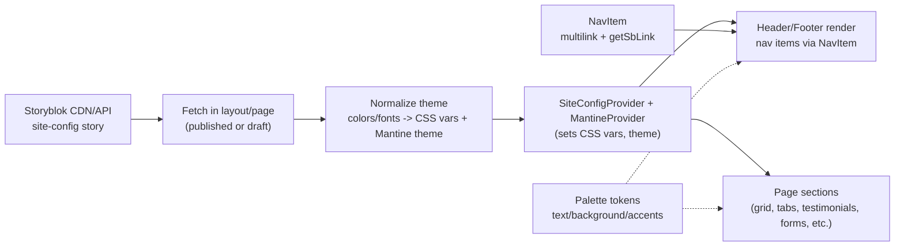

# Site Config & Theming Flow

Purpose: show how the Storyblok `site-config` story drives header/footer, CSS variables, and Mantine theme for all sections.

Notes

- Layout fetches `site-config` (published or draft depending on mode).
- Colors/fonts are normalized into CSS variables and Mantine theme overrides.
- Header/footer/nav come from site-config bloks (NavItem uses getSbLink sanitizer).
- Page sections inherit theme tokens (light surfaces, text color, button styles) via providers.

