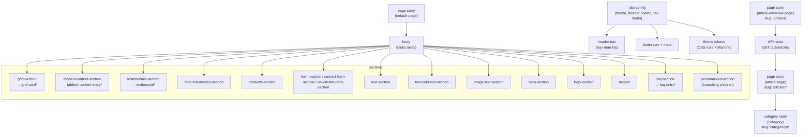

# Storyblok Data Model (Key Bloks)

Purpose: map core content types and how pages compose them.

Notes

- Focused on page composition and shared config; not exhaustive of every field.

## Articles (overview + detail)

- Article listing is driven by Storyblok folders:
  - `articles/` contains `article-page` stories (detail pages)
  - `categories/` contains `category` stories (used as relations on articles)
- The Article Overview page (`article-overview-page`) fetches from `GET /api/articles` and supports:
  - Search (title/excerpt/category names)
  - Category filtering
  - Category ordering based on the Storyblok folder order (`categories/` sorted by `position:asc`)

## Products (plugin-driven)

- The `products-section` blok renders cards from a Storyblok **plugin field** (demo plugin: `sb-fake-ecommerce`).
- Items are rendered directly from the plugin payload; a small demo SKU catalog is used to fill gaps and to mark sold-out items.
